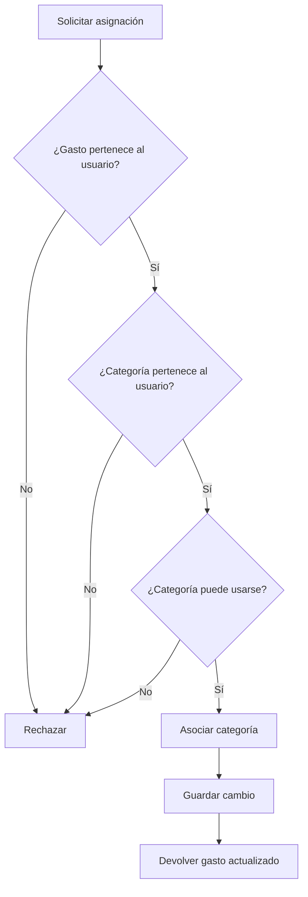

# Labs — Tema 1: Pensamiento computacional y resolución de problemas

> **Objetivo:** practicar el razonamiento previo a la implementación: comprender problemas, identificar requisitos, descomponer, abstraer, reconocer patrones, diseñar soluciones y separar necesidades de decisiones tecnológicas.

---

## 1. Tipo de práctica recomendada

Este tema se aprende mejor resolviendo situaciones en las que la dificultad principal no sea escribir código, sino **entender correctamente qué debe resolverse y cómo representarlo**.

Las prácticas más útiles son:

- **Análisis de problemas:** distinguir necesidad, restricciones, supuestos y preguntas abiertas.
- **Descomposición:** dividir una funcionalidad en partes manejables sin fragmentarla innecesariamente.
- **Abstracción:** conservar información relevante y descartar detalles que no afectan la decisión actual.
- **Reconocimiento de patrones:** identificar semejanzas en datos, comportamiento o requisitos sin aplicar automáticamente patrones de diseño.
- **Diseño previo a la implementación:** definir entradas, salidas, reglas, estados, errores y casos límite.
- **Pseudocódigo:** representar la lógica sin quedar atado a la sintaxis de un lenguaje.
- **Diagramas:** utilizar flujo, estados o secuencia cuando ayuden a comunicar mejor.
- **Revisión crítica:** encontrar supuestos ocultos, decisiones prematuras y complejidad innecesaria.
- **Problema vs. tecnología:** aprender a reformular propuestas técnicas en términos de la necesidad que intentan resolver.

### Cómo trabajar cada ejercicio

Para obtener mayor valor:

1. Resuélvelo sin buscar primero una implementación.
2. Escribe explícitamente tus supuestos.
3. Si falta información, anótala como pregunta abierta.
4. Justifica las decisiones relevantes.
5. No introduzcas una tecnología salvo que sea necesaria para explicar una alternativa.
6. Revisa tu respuesta utilizando los criterios de evaluación.

---

# 2. Ejercicio básico — Descomposición

## Escenario

Estás desarrollando una aplicación personal para organizar tareas.

La nueva funcionalidad solicitada es:

> **Permitir que un usuario cree una tarea con fecha límite y pueda consultar cuáles tareas vencen hoy.**

Una tarea contiene inicialmente:

- título;
- descripción opcional;
- fecha límite;
- estado.

Los estados posibles son:

- pendiente;
- completada.

No se ha definido todavía cómo se almacenarán las tareas ni qué tecnología se utilizará.

---

## Tu trabajo

Analiza el problema y entrega una propuesta con las siguientes secciones.

### 1. Objetivo

Explica en una o dos frases:

- qué necesidad intenta resolver la funcionalidad;
- qué resultado espera obtener el usuario.

### 2. Entradas

Identifica la información necesaria para:

- crear una tarea;
- consultar las tareas que vencen hoy.

### 3. Salidas

Indica qué debería producir cada operación.

### 4. Descomposición

Divide la funcionalidad en subproblemas razonables.

Por ejemplo, piensa en aspectos como:

```text
crear tarea
consultar tareas
determinar si una tarea vence hoy
...
```

No copies necesariamente esta estructura si encuentras una mejor.

### 5. Reglas básicas

Identifica reglas que deberían cumplirse.

Algunas preguntas para ayudarte:

- ¿puede una tarea no tener título?
- ¿puede tener una fecha anterior al día actual?
- ¿una tarea completada debería aparecer como "vence hoy"?
- ¿qué significa exactamente "hoy"?

### 6. Casos límite

Identifica al menos **5 casos límite o situaciones ambiguas**.

---

## Entregable sugerido

```text
Objetivo

Entradas

Salidas

Subproblemas

Reglas

Casos límite

Preguntas abiertas
```

---

## Criterios de evaluación

Tu respuesta es sólida si:

- [ ] explica la necesidad sin introducir tecnologías;
- [ ] diferencia claramente creación y consulta;
- [ ] identifica entradas y salidas;
- [ ] la descomposición tiene partes con responsabilidades comprensibles;
- [ ] contempla el estado de la tarea;
- [ ] identifica al menos una ambigüedad relacionada con fecha/hora;
- [ ] incluye casos límite reales;
- [ ] distingue reglas confirmadas de supuestos.

---

# 3. Ejercicio intermedio — Abstracción y reconocimiento de patrones

## Escenario

Un equipo está diseñando una funcionalidad para mostrar el historial de actividad de un usuario.

Durante una reunión aparecen los siguientes datos:

- nombre del usuario;
- correo electrónico;
- foto de perfil;
- dispositivo desde el que realizó la acción;
- sistema operativo;
- navegador;
- fecha de la acción;
- tipo de acción;
- IP;
- color favorito del usuario;
- identificador de la acción;
- descripción;
- versión de la aplicación;
- idioma del usuario;
- hora local;
- ubicación aproximada;
- nombre de la mascota del usuario.

La funcionalidad solicitada inicialmente es:

> **Mostrar al usuario una lista cronológica de las acciones relevantes que ha realizado dentro de la aplicación.**

Ejemplos de acciones:

```text
Creó una categoría
Registró un gasto
Editó un presupuesto
Eliminó una meta
Cambió su contraseña
```

Además, varias de estas acciones comparten datos similares:

```text
tipo
fecha
descripción
entidad afectada
identificador de la entidad
```

---

## Tu trabajo

### 1. Información relevante

Clasifica los datos disponibles en:

```text
Necesarios para el objetivo actual

Potencialmente útiles

Irrelevantes para el objetivo actual
```

Justifica brevemente los casos que no sean evidentes.

### 2. Abstracción

Propón una representación conceptual simplificada para una:

```text
Actividad
```

No pienses todavía en clases, tablas o JSON.

Describe únicamente qué información debería representar.

### 3. Patrones

Identifica al menos:

- 2 patrones en los datos;
- 2 patrones en el comportamiento;
- 1 patrón en los requisitos.

### 4. Diferencias importantes

Indica qué acciones podrían **parecer iguales**, pero necesitar información adicional.

Por ejemplo:

```text
Cambió su contraseña
```

podría tener implicaciones distintas de:

```text
Registró un gasto
```

Explica por qué.

### 5. Representación simplificada

Propón una estructura conceptual semejante a:

```text
Actividad
- ...
- ...
- ...
```

No la conviertas todavía en modelo de base de datos.

---

## Preguntas para profundizar

- ¿Todas las actividades necesitan tener una entidad asociada?
- ¿"Eliminar una meta" debería conservar el identificador de la meta?
- ¿qué detalles pertenecen al historial mostrado al usuario y cuáles a auditoría interna?
- ¿una misma abstracción debería cubrir ambos usos?

---

## Criterios de evaluación

- [ ] conservas únicamente información relevante para el problema;
- [ ] no confundes "dato disponible" con "dato necesario";
- [ ] identificas regularidades reales;
- [ ] no aplicas automáticamente un patrón de diseño;
- [ ] distingues historial de usuario de auditoría técnica;
- [ ] la abstracción propuesta reduce complejidad;
- [ ] mencionas al menos un riesgo de abstraer demasiado pronto.

---

# 4. Ejercicio intermedio/avanzado — Diseñar antes de implementar

## Escenario

En una aplicación de suscripciones se solicita la siguiente funcionalidad:

> **Un usuario puede pausar temporalmente una suscripción y reanudarla posteriormente.**

Condiciones iniciales confirmadas:

- una suscripción puede estar activa;
- una suscripción activa puede pausarse;
- una suscripción pausada puede reanudarse;
- una suscripción cancelada no puede reanudarse;
- mientras esté pausada, no debe considerarse activa;
- el historial de cambios debe conservarse.

No se ha definido:

- si existe una fecha máxima para permanecer pausada;
- si la pausa tiene efecto inmediato;
- si la reanudación puede programarse;
- qué ocurre con pagos pendientes;
- qué ocurre si dos solicitudes llegan casi al mismo tiempo.

No debes elegir todavía framework, base de datos, broker, lenguaje ni proveedor.

---

## Tu trabajo

Diseña la funcionalidad antes de pensar en implementación.

### 1. Problema

Explica cuál es la necesidad de negocio.

### 2. Requisitos

Clasifica:

```text
Requisitos confirmados

Preguntas abiertas

Supuestos que evitarías realizar
```

### 3. Subproblemas

Descompón el flujo.

Algunas áreas que podrías analizar:

- validar transición;
- registrar cambio;
- preservar historial;
- determinar estado final;
- responder ante acciones inválidas.

### 4. Entradas

Define qué información necesita:

```text
pausar
reanudar
```

### 5. Salidas

Define qué debería devolver cada operación.

### 6. Reglas

Enumera las reglas del dominio.

### 7. Estados

Propón los estados necesarios.

Como mínimo analiza:

```text
active
paused
cancelled
```

Puedes añadir estados si existe una justificación clara.

### 8. Casos límite

Identifica al menos **7 casos límite**.

Incluye situaciones relacionadas con:

- acciones repetidas;
- concurrencia;
- solicitudes inválidas;
- información incompleta;
- estado inconsistente.

### 9. Pseudocódigo

Escribe pseudocódigo para:

```text
pause_subscription(...)
resume_subscription(...)
```

Debe expresar intención, no detalles de infraestructura.

### 10. Diagrama

Decide qué diagrama aporta más:

- flujo;
- estados;
- secuencia;
- ninguno.

Si eliges uno, créalo.

---

## Criterios de evaluación

- [ ] separas claramente problema y solución;
- [ ] no inventas respuestas para las preguntas abiertas;
- [ ] modelas correctamente las transiciones;
- [ ] distingues transición inválida de error técnico;
- [ ] consideras concurrencia;
- [ ] el pseudocódigo no depende de framework;
- [ ] el diagrama seleccionado corresponde al tipo de problema;
- [ ] el diseño podría implementarse de varias formas tecnológicas.

---

# 5. Ejercicio avanzado — Problema vs. tecnología

## Escenario

Durante una reunión técnica, cinco desarrolladores hacen las siguientes propuestas.

### Propuesta A

> "Necesitamos Redis porque algunos usuarios envían dos veces el formulario y se crean registros duplicados."

### Propuesta B

> "Debemos usar Kafka porque algunas tareas tardan varios segundos y no queremos que el usuario espere."

### Propuesta C

> "Esta nueva funcionalidad debería ser un microservicio porque posiblemente crezca en el futuro."

### Propuesta D

> "Necesitamos WebSockets porque la pantalla debe mostrar datos actualizados."

### Propuesta E

> "Use­mos una base NoSQL porque algunos registros tienen campos opcionales."

---

## Tu trabajo

Para **cada propuesta**, responde:

### 1. Problema real

Reformula la propuesta sin mencionar la tecnología.

Ejemplo de formato:

```text
A.

Problema:
...

Propiedad buscada:
...
```

### 2. Requisitos faltantes

Enumera qué información necesitarías antes de decidir.

### 3. Decisión prematura

Explica qué conclusión técnica se tomó demasiado pronto.

### 4. Alternativas

Enumera al menos **3 alternativas conceptuales o técnicas** que deberían evaluarse.

### 5. Criterios de decisión

Indica qué factores utilizarías para comparar las alternativas.

---

## Parte adicional

Clasifica cada caso según la propiedad principal que parece buscar:

```text
idempotencia
asincronía
independencia de despliegue
actualización en tiempo real
flexibilidad de modelo
```

Puedes utilizar otra propiedad si consideras que alguna describe mejor el problema.

---

## Criterios de evaluación

- [ ] puedes expresar todos los problemas sin nombrar productos;
- [ ] identificas requisitos faltantes relevantes;
- [ ] propones alternativas genuinas, no solamente productos equivalentes;
- [ ] utilizas propiedades técnicas para comparar soluciones;
- [ ] evitas concluir que una herramienta es correcta sin suficiente contexto;
- [ ] distingues necesidad de arquitectura y mecanismo de implementación.

---

# 6. Ejercicio de revisión crítica

## Escenario

Otro desarrollador propone la siguiente solución para una funcionalidad de notificaciones:

> Necesitamos avisar al usuario cuando su presupuesto mensual llegue al 80%.
>
> Voy a crear un microservicio de alertas separado.
>
> Cada vez que se registra un gasto enviaremos el gasto mediante Kafka.
>
> El microservicio guardará el presupuesto del usuario en MongoDB.
>
> También utilizaremos Redis para evitar notificar dos veces.
>
> Como puede haber muchos tipos de alertas, crearé una clase abstracta `BaseAlert`, una `AlertFactory`, una interfaz `AlertStrategy`, una `BudgetAlertStrategy` y un `NotificationFacade`.
>
> Cuando llegue un gasto, el servicio sumará el importe al gasto mensual almacenado y, si supera el 80%, enviará la notificación.
>
> Más adelante podemos agregar email, SMS y push.

---

## Tu trabajo

Realiza una revisión crítica de la propuesta.

No debes diseñar todavía la solución definitiva.

### Analiza al menos:

#### 1. Necesidad

- ¿está suficientemente definida?
- ¿qué significa "llegue al 80%"?
- ¿una notificación se envía exactamente al cruzar el umbral o siempre que esté por encima?

#### 2. Supuestos

Identifica supuestos que el desarrollador realizó sin validar.

#### 3. Descomposición

Evalúa si los componentes propuestos corresponden a problemas reales.

#### 4. Abstracciones

Analiza:

```text
BaseAlert
AlertFactory
AlertStrategy
NotificationFacade
```

¿Existe evidencia suficiente para necesitar todas?

#### 5. Casos límite ignorados

Busca situaciones relacionadas con:

- editar gasto;
- eliminar gasto;
- cancelar gasto;
- cambiar presupuesto;
- registrar gastos antiguos;
- varias monedas;
- concurrencia.

#### 6. Dependencia tecnológica

Identifica todas las tecnologías elegidas antes de conocer suficientemente los requisitos.

#### 7. Preguntas que harías

Escribe al menos **10 preguntas** antes de aprobar el diseño.

#### 8. Replanteamiento

Reformula la funcionalidad en términos del problema y las propiedades buscadas.

No propongas todavía arquitectura final.

---

## Criterios de evaluación

Una buena revisión:

- [ ] no se limita a criticar nombres de tecnologías;
- [ ] identifica problemas de requisitos;
- [ ] separa problemas funcionales y técnicos;
- [ ] detecta abstracciones posiblemente prematuras;
- [ ] considera cambios sobre datos existentes;
- [ ] analiza consistencia;
- [ ] detecta riesgo de notificaciones duplicadas;
- [ ] plantea preguntas antes de escoger arquitectura;
- [ ] mantiene abierta más de una solución posible.

---

# 7. Ejemplo resuelto de referencia

## Ejercicio

Diseñar la funcionalidad:

> **Crear categorías de gastos y permitir que cada gasto se asigne a una categoría.**

El objetivo de este ejemplo es mostrar cómo estructurar el razonamiento antes de implementar.

---

## 7.1 Identificación del problema

El usuario necesita organizar sus gastos para poder entender posteriormente **en qué tipos de cosas está utilizando su dinero**.

La necesidad principal no es:

```text
crear una tabla categories
```

sino:

```text
clasificar gastos utilizando conceptos comprensibles para el usuario
```

---

## 7.2 Requisitos

### Requisitos confirmados para el ejercicio

- el usuario puede crear categorías;
- una categoría tiene un nombre;
- los gastos pueden asociarse con una categoría;
- cada usuario administra sus propias categorías;
- dos usuarios pueden utilizar categorías con el mismo nombre.

### Preguntas abiertas

- ¿un gasto puede no tener categoría?
- ¿puede tener varias?
- ¿una categoría puede eliminarse?
- ¿qué ocurre con gastos históricos si se elimina?
- ¿se pueden renombrar categorías?
- ¿debe impedirse que un usuario cree dos categorías con el mismo nombre?
- ¿existen categorías predeterminadas?

### Supuestos que no deberíamos realizar

No asumir, por ejemplo:

```text
cada gasto siempre tendrá exactamente una categoría
```

si el requisito todavía no lo ha definido.

---

## 7.3 Descomposición

Podemos separar el problema en:

```text
Gestión de categorías
├── crear categoría
├── consultar categorías
└── validar categoría

Clasificación de gasto
├── seleccionar categoría
├── comprobar pertenencia
└── asociar gasto
```

Más adelante podrían existir otros subproblemas:

```text
renombrar
archivar
fusionar
eliminar
```

Pero no necesitamos resolverlos todavía.

---

## 7.4 Reconocimiento de patrones

### Patrón en los datos

Tanto categorías de gasto como otros clasificadores futuros podrían tener:

```text
nombre
propietario
estado
```

Esto es una semejanza interesante, pero todavía no justifica crear una abstracción genérica.

### Patrón en comportamiento

Diferentes operaciones necesitan verificar:

> que un recurso utilizado por un usuario realmente le pertenece.

Ejemplos futuros:

- categoría;
- presupuesto;
- cuenta;
- meta.

### Patrón en requisitos

Varias funcionalidades pueden necesitar:

```text
clasificar información para facilitar consultas y análisis
```

---

## 7.5 Abstracción

### Categoría

Para el problema actual basta pensar:

```text
Category

Representa una clasificación definida por un usuario
para agrupar gastos conceptualmente relacionados.
```

Información relevante:

```text
identidad
usuario propietario
nombre
estado si eventualmente puede archivarse
```

No necesitamos todavía pensar en:

- ORM;
- tabla;
- UUID;
- endpoint;
- JSON.

### Asociación conceptual

```text
Expense → Category
```

Significa:

> este gasto se considera parte de esa clasificación.

No define todavía cómo se representa técnicamente la relación.

---

## 7.6 Diseño

### Crear categoría

Entrada conceptual:

```text
usuario
nombre
```

Salida:

```text
categoría creada
```

Reglas mínimas:

```text
nombre no vacío
usuario válido
```

Si negocio decide nombres únicos:

```text
no debe existir otra categoría equivalente para ese usuario
```

Pero no debemos asumir esa regla.

### Asignar categoría a un gasto

Entradas:

```text
usuario
gasto
categoría
```

Reglas:

```text
el gasto pertenece al usuario
la categoría pertenece al usuario
la categoría puede utilizarse
```

Salida:

```text
gasto clasificado
```

---

## 7.7 Casos límite

### Caso 1 — Nombre vacío

```text
""
```

Debe rechazarse.

### Caso 2 — Solo espacios

```text
"   "
```

Probablemente debería normalizarse antes de validar.

### Caso 3 — Duplicados

```text
Comida
comida
COMIDA
```

Pregunta de negocio:

> ¿se consideran la misma categoría?

### Caso 4 — Categoría de otro usuario

Debe rechazarse.

### Caso 5 — Categoría eliminada o archivada

Si existe este concepto:

> ¿puede asignarse a nuevos gastos?

### Caso 6 — Gasto sin categoría

Necesitamos saber si está permitido.

### Caso 7 — Eliminación de categoría utilizada

Opciones posibles:

```text
impedir eliminación
archivar
dejar gastos históricos
reasignar
usar "Sin categoría"
```

Esto requiere definición de negocio.

---

## 7.8 Pseudocódigo

### Crear categoría

```text
PROCEDURE create_category(user, name):

    normalized_name = NORMALIZE name

    IF normalized_name is empty:
        RETURN validation_error

    IF business_requires_unique_names:
        IF equivalent category exists for user:
            RETURN category_already_exists

    category = CREATE category(
        owner = user,
        name = normalized_name
    )

    SAVE category

    RETURN category
```

Observa la línea:

```text
IF business_requires_unique_names
```

Nos recuerda que la unicidad es una regla de negocio pendiente, no una decisión técnica automática.

### Asignar categoría

```text
PROCEDURE assign_category(user, expense, category):

    IF expense does not belong to user:
        RETURN forbidden

    IF category does not belong to user:
        RETURN invalid_category

    IF category cannot be used:
        RETURN invalid_category

    ASSOCIATE expense WITH category

    SAVE change

    RETURN expense
```

---

## 7.9 Diagrama

Aquí un flowchart resulta útil porque queremos representar validaciones antes de la asociación.



No necesitamos un diagrama de estados porque el problema actual no gira principalmente alrededor de un ciclo de vida.

---

## 7.10 Validación de la solución

Podemos comprobarla mediante escenarios.

### Escenario A

```text
Usuario A
Categoría: Alimentación
Gasto: Supermercado
```

Ambos pertenecen al usuario.

Resultado:

```text
asignación válida
```

### Escenario B

```text
Usuario A
Categoría perteneciente a Usuario B
```

Resultado:

```text
rechazar
```

### Escenario C

```text
Nombre de categoría = " "
```

Resultado:

```text
rechazar
```

### Escenario D

```text
Usuario crea "Comida"
Luego crea "comida"
```

Resultado:

```text
no podemos concluirlo hasta definir
la política de nombres duplicados
```

Esto es importante:

> una solución madura no inventa requisitos para completar artificialmente el diseño.

---

## 7.11 Qué aprendemos del ejemplo

El proceso utilizado fue:

```text
necesidad
↓
requisitos
↓
preguntas abiertas
↓
descomposición
↓
patrones
↓
abstracción
↓
reglas
↓
casos límite
↓
pseudocódigo
↓
validación
```

Todavía no necesitábamos decidir:

```text
FastAPI
PostgreSQL
SQLAlchemy
Redis
microservicio
```

Esas decisiones pueden analizarse después.

---

# 8. Aplicación al proyecto personal de gastos

## Práctica — Definir un presupuesto mensual por categoría

Tu proyecto permitirá que el usuario defina algo semejante a:

```text
Categoría: Alimentación
Presupuesto mensual: $300
```

El objetivo es que posteriormente la aplicación pueda comparar gastos contra ese presupuesto.

No debes implementar todavía alertas ni notificaciones.

---

## Tu trabajo

Diseña únicamente:

> **Crear y mantener el presupuesto mensual de una categoría.**

Entrega:

### 1. Problema

¿Qué necesidad está resolviendo?

### 2. Requisitos

Separa:

```text
confirmados
supuestos
preguntas abiertas
```

### 3. Conceptos

¿Qué conceptos del dominio aparecen?

Ejemplo:

```text
presupuesto
período
categoría
importe
```

No los conviertas automáticamente en clases.

### 4. Descomposición

Divide la funcionalidad.

### 5. Reglas

Analiza al menos:

- importe;
- período;
- propiedad de la categoría;
- duplicados;
- modificaciones.

### 6. Casos límite

Incluye al menos **8**.

### 7. Pseudocódigo

Escribe pseudocódigo para:

```text
define_budget(...)
```

### 8. Representación visual

Decide si necesitas:

```text
flowchart
state diagram
sequence
ninguno
```

Justifica.

### 9. Decisiones tecnológicas que NO tomarías todavía

Escribe al menos cinco.

Ejemplo:

```text
No decidiría todavía cómo persistir el presupuesto.
```

---

## Criterios de evaluación

- [ ] puedes explicar el presupuesto como concepto de dominio;
- [ ] identificas qué significa "mensual";
- [ ] analizas modificaciones del presupuesto;
- [ ] consideras zonas temporales o períodos cuando corresponda;
- [ ] no mezclas todavía alertas con creación del presupuesto;
- [ ] distingues reglas de negocio y almacenamiento;
- [ ] el pseudocódigo expresa intención;
- [ ] declaras preguntas abiertas.

---

# 9. Extensión opcional

## Variante avanzada — Presupuestos compartidos entre varias categorías

Amplía el ejercicio anterior.

Ahora el usuario puede definir:

```text
Presupuesto: Ocio
Límite mensual: $200

Incluye:
- Restaurantes
- Cine
- Viajes cortos
```

Una categoría puede pertenecer como máximo a un presupuesto compartido durante el mismo período.

---

## Analiza

### 1. Cómo cambia el problema

¿Qué supuestos del ejercicio anterior dejan de ser válidos?

### 2. Nuevas abstracciones

¿Sigue siendo correcto pensar:

```text
presupuesto → categoría
```

o necesitamos una representación diferente?

### 3. Reglas

Analiza:

- categorías repetidas;
- cambio de grupo;
- presupuesto individual + compartido;
- períodos;
- gastos históricos.

### 4. Casos límite

Añade al menos **8 nuevos casos**.

### 5. Descomposición

Actualiza la solución sin pensar todavía en tablas ni endpoints.

### 6. Comparación

Compara:

```text
Presupuesto por categoría

vs.

Presupuesto que agrupa categorías
```

Identifica:

- semejanzas;
- diferencias;
- abstracciones reutilizables;
- abstracciones que ya no sirven.

### 7. Pregunta final

Responde:

> ¿En qué momento la generalización empieza a simplificar el modelo y en qué momento empieza a hacerlo más difícil de entender?

No existe una única respuesta correcta.

Justifica tu criterio.

---

# Forma recomendada de trabajar este lab

No intentes completar todo en una sola sesión.

Una secuencia razonable sería:

```text
Sesión 1
Ejercicio 2

Sesión 2
Ejercicio 3

Sesión 3
Ejercicio 4

Sesión 4
Ejercicio 5

Sesión 5
Ejercicio 6

Después
Ejercicio 8 aplicado al proyecto
```

El **Ejemplo resuelto de referencia** puede consultarse después de intentar un ejercicio por tu cuenta.

Evita usarlo como plantilla rígida.

Su propósito es mostrar una forma posible de razonar, no una estructura obligatoria.

---

# Checklist general de autoevaluación

Antes de considerar terminado cualquier ejercicio, pregúntate:

- [ ] ¿puedo explicar el problema sin mencionar tecnologías?
- [ ] ¿distingo hechos, supuestos y preguntas abiertas?
- [ ] ¿identifiqué entradas y salidas?
- [ ] ¿la descomposición refleja responsabilidades reales?
- [ ] ¿detecté patrones sin forzar abstracciones?
- [ ] ¿eliminé detalles irrelevantes?
- [ ] ¿consideré casos límite?
- [ ] ¿consideré errores?
- [ ] ¿consideré estados cuando aplican?
- [ ] ¿consideré concurrencia cuando aplica?
- [ ] ¿puedo expresar la solución mediante pseudocódigo?
- [ ] ¿elegí un diagrama solo si aporta?
- [ ] ¿evité seleccionar tecnología antes de comprender el problema?
- [ ] ¿puedo justificar mis decisiones?
- [ ] ¿sé qué preguntas todavía necesitan respuesta?

---

# Resultado esperado del tema

Después de completar estas prácticas deberías empezar a desarrollar un reflejo semejante a:

```text
Me presentan una funcionalidad
        ↓
No pregunto inmediatamente "¿cómo la programo?"
        ↓
Primero pregunto "¿qué problema estamos resolviendo?"
        ↓
Aclaro requisitos
        ↓
Descompongo
        ↓
Modelo
        ↓
Busco límites y errores
        ↓
Represento la solución
        ↓
Después evalúo tecnología
```

Ese cambio de orden es uno de los objetivos principales de este primer tema del roadmap.