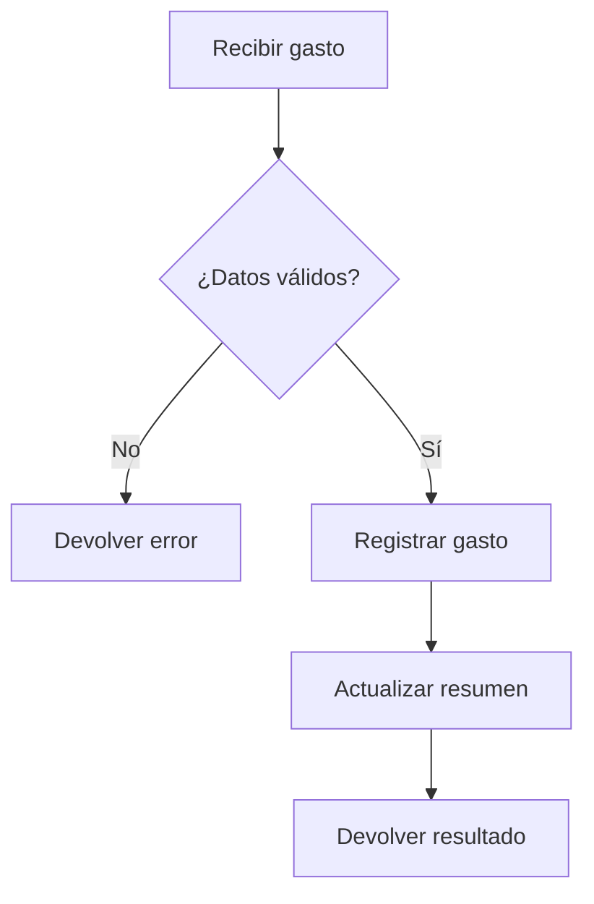
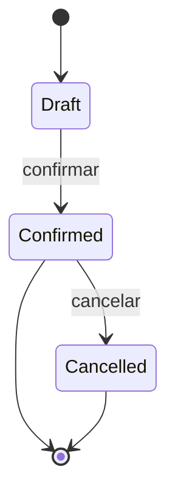
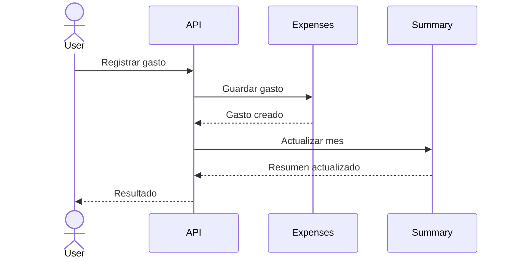
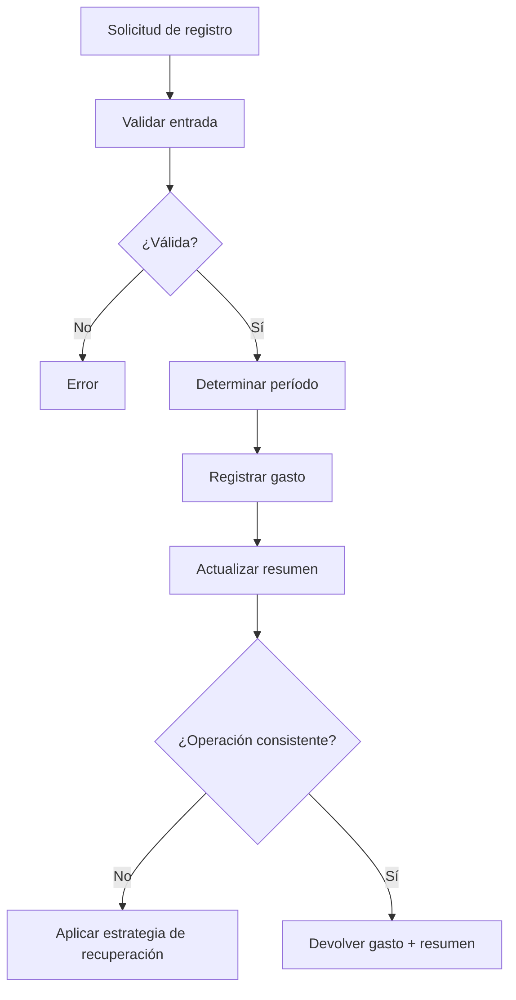

# Bloque 1 — Tema 1: Pensamiento computacional y resolución de problemas

> **Objetivo del tema:** reforzar la capacidad de comprender, estructurar y modelar problemas antes de convertirlos en código o decisiones tecnológicas.

---

## 1. Introducción

El pensamiento computacional es una forma de abordar problemas utilizando ideas fundamentales de la informática: descomponer, identificar regularidades, abstraer lo relevante, representar el problema de forma manejable y construir procedimientos claros para resolverlo.

Jeannette Wing popularizó el término en ingeniería informática moderna describiéndolo como una forma de resolver problemas, diseñar sistemas y comprender comportamientos recurriendo a conceptos fundamentales de la ciencia de la computación [1].

La idea importante es que **pensamiento computacional no significa simplemente programar**.

Programar es una posible etapa final. Antes de escribir código necesitamos decidir:

- qué problema estamos resolviendo;
- qué información importa;
- qué restricciones existen;
- qué partes pueden tratarse por separado;
- qué situaciones se repiten;
- qué casos pueden fallar;
- qué comportamiento esperamos;
- qué decisiones pertenecen al dominio y cuáles pertenecen a la implementación.

Esto sigue siendo importante aunque una IA pueda producir código rápidamente.

Una IA puede generar una implementación plausible a partir de una descripción incompleta. El problema es precisamente ese: una implementación técnicamente correcta puede resolver **el problema equivocado**.

La responsabilidad del ingeniero se desplaza cada vez más desde escribir cada línea manualmente hacia actividades como:

- formular correctamente problemas;
- evaluar supuestos;
- diseñar límites;
- reconocer alternativas;
- validar soluciones;
- identificar riesgos;
- revisar código o diseños generados automáticamente.

Por eso, cuanto más fácil resulte producir código, más valioso resulta saber **qué código debería existir y por qué**.

---

## 2. Definición

### 2.1 Definición intuitiva

Pensamiento computacional significa:

> **Tomar un problema que inicialmente puede parecer grande, ambiguo o complejo y transformarlo progresivamente en una representación suficientemente clara como para diseñar una solución verificable.**

No implica necesariamente utilizar un computador.

Podemos aplicar esta forma de pensar al organizar un proceso manual, diseñar un flujo de negocio, investigar un error o decidir cómo dividir un sistema.

### 2.2 Definición técnica

Una formulación útil para ingeniería de software es:

> El pensamiento computacional es un conjunto de estrategias cognitivas para formular problemas y soluciones de manera que puedan ser representados, analizados y eventualmente ejecutados o asistidos mediante procesos computacionales.

Sus componentes suelen incluir, entre otros:

- descomposición;
- abstracción;
- reconocimiento de patrones;
- representación de información;
- diseño algorítmico;
- evaluación de soluciones.

No existe una única taxonomía universal. Distintos autores y materiales educativos agrupan los elementos de manera ligeramente diferente.

### 2.3 Relación con resolución de problemas

Resolver un problema no consiste solamente en encontrar una respuesta.

En ingeniería también necesitamos conocer:

1. qué entendimos del problema;
2. qué supuestos realizamos;
3. qué entradas existen;
4. qué resultado se considera correcto;
5. bajo qué restricciones funciona;
6. qué casos no cubre;
7. cómo sabemos que la solución es válida.

Por eso la resolución estructurada de problemas tiende a producir soluciones más verificables y modificables.

### 2.4 Relación con ingeniería de software

La ingeniería de software añade una dificultad adicional: normalmente no resolvemos problemas aislados, sino problemas que evolucionan.

Un sistema debe poder sobrevivir a:

- nuevos requisitos;
- errores inesperados;
- cambios regulatorios;
- crecimiento de usuarios;
- nuevas integraciones;
- cambios de tecnología;
- diferentes personas trabajando sobre el mismo código.

Por ello, entender el problema y elegir buenas abstracciones suele tener más impacto a largo plazo que escribir rápidamente una primera implementación.

---

## 3. ¿Por qué existe y qué problema resuelve?

El software transforma necesidades humanas o de negocio en comportamiento ejecutable.

Entre ambos extremos existe una distancia considerable:

```text
Necesidad humana
      ↓
Requisitos
      ↓
Modelo del problema
      ↓
Diseño de solución
      ↓
Diseño técnico
      ↓
Implementación
```

Cuando omitimos pasos, tendemos a mezclar decisiones que pertenecen a niveles diferentes.

### Ejemplo: saltar directamente del requisito al código

Requisito:

> Un usuario no debería registrar accidentalmente dos veces el mismo gasto.

Una reacción prematura podría ser:

> Agregaré un índice UNIQUE.

Pero todavía faltan preguntas:

- ¿qué significa "mismo gasto"?
- ¿mismo comercio?
- ¿mismo importe?
- ¿misma fecha?
- ¿misma tarjeta?
- ¿el usuario puede registrar legítimamente dos gastos iguales?
- ¿queremos impedir o solamente advertir?
- ¿los gastos pueden llegar desde importaciones?
- ¿qué ocurre con operaciones concurrentes?

El índice `UNIQUE` no es una necesidad del negocio. Es una posible técnica para satisfacer una definición concreta de unicidad.

### Otro ejemplo

Requisito:

> Enviar el resumen mensual sin retrasar la respuesta al usuario.

Una reacción tecnológica prematura podría ser:

> Pongamos Kafka.

Pero el problema real es:

> Existe trabajo que no necesita completarse antes de responder.

Eso abre diferentes soluciones:

- tareas internas en segundo plano;
- cola de trabajos;
- servicio separado;
- scheduler;
- broker de mensajes;
- arquitectura orientada a eventos.

Kafka puede ser correcto, excesivo o incorrecto dependiendo de volumen, garantías, operaciones, equipo y otras restricciones.

### Qué aporta pensar antes de programar

Pensar estructuradamente permite:

- detectar ambigüedades;
- reducir retrabajo;
- comparar alternativas;
- separar decisiones reversibles de decisiones costosas;
- identificar dependencias;
- encontrar casos límite;
- evitar sobrearquitectura;
- comunicar mejor la solución;
- producir mejores instrucciones para otros desarrolladores o agentes de IA.

---

## 4. Modelo mental general

Un modelo útil para este bloque es:

```text
Necesidad / problema
        ↓
Clarificación y restricciones
        ↓
Descomposición
        ↓
Patrones y regularidades
        ↓
Abstracción / modelo
        ↓
Diseño de solución
        ↓
Validación de casos
        ↓
Representación
(pseudocódigo / diagramas / contratos)
        ↓
Selección tecnológica
        ↓
Implementación
        ↓
Verificación y retroalimentación
```

No debe entenderse como un proceso rígidamente lineal.

En proyectos reales existen ciclos:

```text
Comprender → Diseñar → Detectar duda → Volver a comprender
```

### 4.1 Necesidad / problema

Describe qué situación necesita cambiar.

Ejemplo:

> Quiero conocer cuánto llevo gastado durante el mes.

Todavía no necesitamos decidir base de datos, framework ni endpoint.

### 4.2 Clarificación y restricciones

Convertimos la necesidad general en condiciones más concretas.

Ejemplo:

- el resumen corresponde a un usuario;
- utiliza una zona horaria definida;
- puede incluir varias monedas;
- los gastos anulados no cuentan;
- el resultado debe actualizarse al registrar un gasto.

### 4.3 Descomposición

Separamos el problema en partes manejables.

Ejemplo:

- validar gasto;
- registrar gasto;
- determinar mes correspondiente;
- calcular/actualizar resumen;
- devolver resultado.

### 4.4 Patrones

Buscamos elementos que se repiten.

Ejemplo:

- todas las operaciones financieras comparten fecha, importe y moneda;
- varias funcionalidades necesitan agrupar movimientos por período;
- distintos tipos de transacción afectan resúmenes.

### 4.5 Abstracción

Construimos conceptos que preservan lo importante y esconden detalles irrelevantes para ese nivel.

Ejemplo:

`Movimiento financiero` puede ser una abstracción útil para ciertos cálculos, aunque internamente existan gastos, ingresos, transferencias y reembolsos.

### 4.6 Diseño de solución

Definimos cómo debería comportarse la solución sin casarla todavía innecesariamente con una tecnología.

### 4.7 Validación

Probamos mentalmente:

- flujo normal;
- límites;
- errores;
- concurrencia;
- datos incompletos;
- comportamientos inesperados.

### 4.8 Representación

Expresamos la solución mediante:

- texto;
- tablas;
- pseudocódigo;
- diagramas;
- contratos de API;
- ejemplos.

### 4.9 Selección tecnológica

Ahora sí evaluamos mecanismos concretos.

Por ejemplo:

- PostgreSQL;
- Redis;
- Celery;
- FastAPI;
- Kafka;
- almacenamiento en memoria;
- procesamiento síncrono.

### 4.10 Implementación y retroalimentación

La implementación puede revelar que nuestro modelo era incompleto.

El proceso vuelve entonces hacia arriba.

---

## 5. Descomposición de problemas

### 5.1 Qué significa descomponer

Descomponer significa transformar un problema grande en problemas más pequeños que puedan razonarse con mayor independencia.

No significa simplemente crear muchas funciones o carpetas.

La descomposición empieza antes del código.

### 5.2 Cómo identificar subproblemas

Preguntas útiles:

- ¿qué responsabilidades distintas existen?
- ¿qué información necesita cada parte?
- ¿qué resultado produce?
- ¿qué podría cambiar independientemente?
- ¿qué parte puedo explicar sin mencionar las demás?
- ¿qué decisiones pertenecen a reglas distintas?
- ¿qué pasos podrían fallar por razones diferentes?

### 5.3 Cómo determinar límites

Un buen límite suele tener:

- una responsabilidad comprensible;
- entradas identificables;
- salidas identificables;
- dependencias explícitas;
- reglas coherentes internamente.

Ejemplo:

```text
Registrar gasto
├── Validar información
├── Persistir gasto
├── Actualizar estadísticas
└── Generar efectos secundarios
```

Pero aún podemos descubrir que "actualizar estadísticas" contiene varios conceptos:

```text
Actualizar estadísticas
├── Resumen mensual
├── Presupuesto de categoría
└── Tendencias
```

La profundidad adecuada depende del nivel en el que estamos razonando.

### 5.4 Dependencias entre subproblemas

Descomponer no elimina relaciones.

Debemos identificar:

- orden;
- datos compartidos;
- precondiciones;
- efectos secundarios;
- consistencia.

Ejemplo:

```text
Validar → Registrar → Actualizar resumen
                    ↘ Emitir evento
```

Si el registro falla, quizá no debemos actualizar el resumen.

### 5.5 Descomposición demasiado grande

Señales:

- una parte sigue requiriendo muchas decisiones diferentes;
- contiene muchos "y";
- resulta difícil nombrarla;
- tiene demasiadas razones distintas para cambiar;
- no sabemos claramente cuándo termina.

Ejemplo:

> "Procesar toda la lógica financiera del usuario."

Es demasiado amplio para razonar con precisión.

### 5.6 Descomposición demasiado pequeña

Señales:

- cada paso carece de significado por sí solo;
- necesitamos saltar constantemente entre piezas para entender una sola regla;
- la fragmentación agrega más coordinación que claridad;
- las divisiones reflejan detalles de sintaxis y no del problema.

Ejemplo excesivo:

```text
1. Leer amount.
2. Convertir amount a decimal.
3. Llamar función A.
4. Llamar función B.
5. Incrementar variable.
```

Eso puede describir implementación, pero no necesariamente una buena descomposición del problema.

### 5.7 Ejemplo progresivo: aplicación de gastos

Problema inicial:

> Registrar gastos y conocer cuánto he gastado cada mes.

Primera descomposición:

```text
Gestión de gastos
├── Registro de gastos
├── Consulta de gastos
└── Resumen mensual
```

Al analizar `Registro de gastos`:

```text
Registro de gasto
├── Capturar datos
├── Validar
├── Clasificar
├── Persistir
└── Reflejarlo en el resumen
```

Al analizar `Resumen mensual`:

```text
Resumen mensual
├── Identificar período
├── Seleccionar gastos válidos
├── Convertir/agrupar si corresponde
├── Calcular total
└── Presentar resultado
```

Ahora aparecen preguntas de diseño:

- ¿el resumen se calcula bajo demanda?
- ¿se mantiene precomputado?
- ¿qué ocurre si se edita un gasto anterior?
- ¿qué pasa con reembolsos?
- ¿qué moneda se utiliza?

La descomposición hace visibles preguntas que el requisito inicial ocultaba.

### Heurística

Una descomposición es útil cuando cada parte puede formularse como una pregunta más pequeña y verificable.

---

## 6. Reconocimiento de patrones

### 6.1 Qué significa

Reconocer patrones consiste en identificar semejanzas relevantes entre situaciones.

Esto permite reutilizar razonamiento.

No necesariamente reutilizar código.

### 6.2 Patrones en datos

Ejemplo:

```text
Gasto:
- fecha
- importe
- moneda
- categoría

Ingreso:
- fecha
- importe
- moneda
- categoría/fuente
```

Podemos detectar una regularidad:

> ambos representan movimientos monetarios.

Esto podría originar una abstracción común.

Pero no significa automáticamente que deban compartir una misma tabla o clase.

### 6.3 Patrones en comportamiento

Ejemplo:

- crear gasto;
- editar gasto;
- eliminar gasto;
- importar gasto.

Todas estas operaciones afectan potencialmente:

- resumen mensual;
- presupuesto;
- analítica.

Patrón identificado:

> un cambio en movimientos financieros provoca recalcular o ajustar proyecciones derivadas.

### 6.4 Patrones en requisitos

Supongamos:

- "el usuario debe poder filtrar gastos por mes";
- "el usuario debe poder filtrar ingresos por mes";
- "el usuario debe poder filtrar transferencias por mes".

Podemos identificar un requisito transversal:

> Las operaciones financieras deben poder consultarse por intervalo temporal.

### 6.5 Reutilizar soluciones conocidas

Reconocer que dos problemas comparten estructura permite investigar soluciones previas.

Ejemplo:

> Necesitamos manejar un proceso que atraviesa estados mutuamente excluyentes.

Podría recordarnos una máquina de estados.

Pero todavía debemos comprobar que el problema realmente tiene las propiedades que hacen útil esa solución.

### 6.6 Reconocer patrón ≠ aplicar patrón de diseño

Este punto es importante.

Reconocer:

> Tenemos varios comportamientos intercambiables para calcular una comisión.

puede sugerir Strategy.

Pero concluir automáticamente:

> "Aquí va Strategy"

sería saltar demasiado pronto.

Primero debemos preguntar:

- ¿los comportamientos realmente cambian?
- ¿se seleccionan en runtime?
- ¿necesitamos extensibilidad?
- ¿una función sencilla sería suficiente?
- ¿el patrón reduce o añade complejidad?

Los patrones de diseño son vocabulario y soluciones reutilizables. No son objetivos.

---

## 7. Abstracción

### 7.1 Qué es

Abstraer significa representar un problema conservando los detalles relevantes para el propósito actual y omitiendo aquellos que no necesitamos considerar en ese nivel.

Toda abstracción responde implícitamente a:

> **¿Qué necesito saber ahora y qué puedo ignorar temporalmente?**

### 7.2 Ejemplo cotidiano

Para conducir un automóvil necesitas una abstracción del vehículo:

- acelerador;
- freno;
- dirección;
- indicadores.

No necesitas modelar continuamente:

- combustión;
- control electrónico;
- composición del neumático;
- detalles de transmisión.

Esos detalles existen, pero no pertenecen al nivel actual.

### 7.3 Qué detalles conservar

Conservamos aquellos que afectan:

- decisiones;
- comportamiento;
- restricciones;
- corrección;
- interacción.

### 7.4 Qué detalles ignorar

Ignoramos temporalmente detalles que:

- no modifican la decisión actual;
- pertenecen a niveles inferiores;
- pueden sustituirse sin cambiar el problema que analizamos.

### 7.5 Niveles de abstracción

Ejemplo:

```text
Necesidad
"Quiero saber cuánto gasto"

Dominio
"Un usuario posee movimientos monetarios clasificados"

Aplicación
"Registrar gasto y actualizar resumen"

Diseño técnico
"ExpenseService + MonthlySummary"

Infraestructura
"PostgreSQL + transacción"

Implementación
"SQL / ORM / Python"
```

Cada nivel responde preguntas distintas.

### 7.6 Abstracción en requisitos

Un requisito puede decir:

> El usuario debe recibir una confirmación cuando un gasto se registre correctamente.

No necesita decir todavía:

> Publicar un evento en RabbitMQ.

La primera frase describe comportamiento.

La segunda describe una posible implementación.

### 7.7 Abstracción en código

Ejemplo conceptual:

```text
PaymentGateway
    charge(...)
```

El consumidor puede no necesitar conocer:

- endpoints HTTP;
- tokens;
- retries;
- firma criptográfica;
- proveedor concreto.

### 7.8 Abstracción e information hiding no son idénticos

Se relacionan, pero no son sinónimos.

**Abstracción** se centra en construir un modelo simplificado que expone lo relevante.

**Information hiding** se centra en diseñar límites de forma que ciertas decisiones internas queden ocultas frente a otros módulos.

Parnas mostró que la forma en que un sistema se divide en módulos tiene un efecto profundo sobre su flexibilidad y comprensibilidad [2].

Ejemplo:

```text
Abstracción:
Repositorio de gastos

Interfaz:
save(expense)
find_by_month(month)

Information hiding:
el consumidor no sabe si se utiliza SQL,
un API remoto o almacenamiento local.
```

### 7.9 Riesgo: abstracción prematura

Una abstracción creada antes de entender suficientes casos puede capturar una semejanza superficial.

Ejemplo:

`Transaction` podría parecer una gran superclase para gasto, ingreso, reembolso y transferencia.

Pero después descubrimos:

- transferencias tienen dos cuentas;
- reembolsos referencian una operación original;
- ingresos poseen reglas tributarias distintas;
- gastos pueden asociarse a presupuestos.

Una abstracción demasiado temprana puede obligarnos a introducir excepciones constantemente.

### Heurística

> Espera suficiente evidencia antes de abstraer, pero no tanta como para duplicar indefinidamente el mismo concepto.

---

## 8. Diseño de soluciones paso a paso

Una vez comprendido el problema, necesitamos convertirlo en una estrategia.

Antes del código conviene poder describir al menos:

### 8.1 Entradas

¿Qué información recibe la solución?

Ejemplo:

```text
Registrar gasto

Entradas:
- user_id
- amount
- currency
- occurred_at
- category
- description opcional
```

### 8.2 Salidas

¿Qué produce?

```text
Salida:
- gasto registrado
- resumen mensual actualizado
```

### 8.3 Reglas

Ejemplo:

- importe > 0;
- categoría válida;
- usuario autorizado;
- fecha aceptable;
- moneda soportada;
- gasto anulado no contribuye al total.

### 8.4 Estados

Preguntar si la entidad atraviesa estados.

Ejemplo:

```text
draft → confirmed → cancelled
```

No todas las entidades necesitan una máquina de estados explícita.

### 8.5 Caso normal

Describe el flujo esperado.

```text
Usuario envía gasto válido
→ sistema valida
→ sistema guarda
→ sistema actualiza resumen
→ devuelve resultado
```

### 8.6 Casos límite

Algunos ejemplos:

- importe extremadamente grande;
- fecha 31 de diciembre;
- zona horaria distinta;
- moneda no soportada;
- dos solicitudes idénticas simultáneas;
- resumen aún inexistente;
- categoría eliminada.

### 8.7 Errores

Distinguir tipos ayuda a diseñar respuestas.

Por ejemplo:

```text
Error de validación
Error de autorización
Error de dependencia
Error de persistencia
Conflicto/concurrencia
```

### 8.8 Dependencias

¿Qué necesita la solución?

Conceptualmente:

```text
- almacenamiento de gastos
- catálogo de categorías
- mecanismo de resumen
- información del usuario
```

Todavía no necesitamos decir PostgreSQL, Redis o FastAPI.

### 8.9 Ejemplo completo antes del código

Problema:

> Registrar un gasto y reflejarlo en el total mensual.

Estrategia:

```text
1. Verificar que los datos del gasto sean válidos.
2. Determinar a qué período mensual pertenece.
3. Registrar el gasto.
4. Incorporar su importe al resumen correspondiente.
5. Garantizar que ambas operaciones sean consistentes.
6. Devolver el gasto y el resumen actualizado.
```

Ahora aparece una decisión importante:

> ¿Qué significa "garantizar consistencia"?

Ese problema debe analizarse antes de elegir el mecanismo.

Podría resolverse mediante:

- una transacción de base de datos;
- cálculo bajo demanda;
- eventos + consistencia eventual;
- reconstrucción a partir de movimientos.

La solución adecuada depende de requisitos.

---

## 9. Pseudocódigo

### 9.1 Qué es

El pseudocódigo representa un algoritmo o procedimiento con una sintaxis informal, diseñada para expresar intención sin quedar atada a un lenguaje de programación.

Materiales de MIT lo presentan justamente como una manera de expresar algoritmos a un nivel más abstracto, sin preocuparse por la sintaxis de un lenguaje concreto [3].

### 9.2 Para qué sirve

Es especialmente útil para:

- discutir lógica;
- validar orden de pasos;
- explicar algoritmos;
- identificar decisiones;
- revisar casos;
- comunicar entre personas que usan lenguajes diferentes.

### 9.3 Nivel de detalle

El nivel correcto es aquel en el que cada paso resulta inequívoco para el objetivo del análisis.

Demasiado abstracto:

```text
procesar gasto
```

Demasiado cercano al código:

```text
expense_repository.update_by_id(...)
```

Adecuado:

```text
VALIDAR gasto

SI gasto es válido:
    GUARDAR gasto
    OBTENER período mensual
    ACTUALIZAR resumen del período
    DEVOLVER resultado
SINO:
    DEVOLVER error de validación
```

### 9.4 Cuándo aporta valor

- algoritmos;
- reglas complejas;
- múltiples ramas;
- transformaciones;
- lógica independiente de framework;
- revisión con otra persona.

### 9.5 Cuándo puede ser innecesario

Si el comportamiento es trivial:

> obtener un recurso por ID y devolver 404 si no existe.

Quizá una descripción textual sea suficiente.

### 9.6 Pseudocódigo vs. código real

| Pseudocódigo | Código |
|---|---|
| Expresa intención | Debe ejecutarse |
| Sintaxis flexible | Sintaxis estricta |
| Independiente del lenguaje | Dependiente del lenguaje |
| Puede omitir detalles técnicos | Debe resolverlos |
| Optimiza comunicación | Optimiza ejecución/mantenibilidad |

---

## 10. Diagramas simples

Un diagrama es útil cuando una relación espacial o temporal comunica mejor que un párrafo.

No conviene dibujar por obligación.

### 10.1 Diagrama de flujo

Útil para:

- decisiones;
- bifurcaciones;
- pasos;
- validaciones.



Mermaid define los flowcharts mediante nodos y conexiones, por lo que funcionan bien para representar procesos y decisiones sencillas [4].

### 10.2 Diagrama de estados

Útil cuando queremos entender:

> ¿En qué estados puede encontrarse algo y qué eventos permiten cambiarlo?



Un diagrama de estados expresa estados y transiciones [5].

### 10.3 Secuencia simple

Útil cuando importa:

> ¿Quién interactúa con quién y en qué orden?



Los diagramas de secuencia representan interacciones y su orden temporal [6].

### 10.4 Regla práctica

Usa:

- **flowchart** para lógica;
- **state diagram** para ciclo de vida;
- **sequence diagram** para interacciones;
- texto o tabla cuando la información no necesita dimensión visual.

No necesitas UML formal para obtener valor de estos modelos.

---

## 11. Separar problema e implementación

Este es uno de los hábitos más importantes de ingeniería.

### 11.1 Dos espacios diferentes

Podemos pensar en:

```text
ESPACIO DEL PROBLEMA
¿Qué necesitamos conseguir?
¿Qué restricciones existen?
¿Qué comportamiento esperamos?

              ↓

ESPACIO DE SOLUCIONES
¿Qué mecanismos podrían satisfacerlo?
¿Qué compromisos tienen?
¿Qué tecnología utilizar?
```

IEEE describe los requisitos como condiciones o capacidades que el sistema debe satisfacer para resolver una necesidad u objetivo [7]. El diseño de solución, en cambio, traduce esas necesidades a una arquitectura o implementación coherente [8].

### 11.2 Ejemplo: duplicados

Problema:

> Necesito evitar registros duplicados.

Antes de tecnología:

- ¿cómo se define duplicado?
- ¿qué actor puede producirlo?
- ¿debemos impedirlo o detectarlo?
- ¿qué ventana temporal importa?
- ¿existen solicitudes repetidas por retry?
- ¿es un problema de identidad o de contenido?

Posibles soluciones:

- identificador idempotente;
- constraint de base de datos;
- hash;
- deduplicación temporal;
- detección heurística;
- confirmación del usuario.

Redis es solo una posible herramienta dentro de alguna de esas estrategias.

### 11.3 Ejemplo: trabajo no bloqueante

Problema:

> Necesito ejecutar una tarea sin bloquear la respuesta HTTP.

Preguntas:

- ¿la tarea puede perderse?
- ¿cuánto tarda?
- ¿necesita retry?
- ¿debe sobrevivir reinicios?
- ¿qué volumen existe?
- ¿hay orden?
- ¿hay múltiples consumidores?
- ¿se necesita trazabilidad?

Alternativas:

```text
Background task local
Job queue
Worker externo
Scheduler
Message broker
Streaming platform
```

Kafka solamente tiene sentido para algunos conjuntos de requisitos.

### 11.4 Ejemplo: cache

Mala formulación:

> Necesitamos Redis.

Mejor:

> La misma información costosa de calcular se consulta repetidamente y toleramos que permanezca hasta 60 segundos desactualizada.

Ahora sí podemos analizar:

- cache local;
- Redis;
- CDN;
- materialized view;
- precálculo.

### 11.5 Ejemplo: microservicios

Mala formulación:

> Este módulo debe ser un microservicio.

Problema posible:

> Dos áreas necesitan desplegar y evolucionar independientemente y tienen límites de dominio bien diferenciados.

Solo después evaluamos si separar procesos/servicios realmente mejora:

- autonomía;
- escalabilidad;
- ownership;
- despliegue;
- aislamiento.

Y qué costes introduce:

- red;
- observabilidad;
- consistencia distribuida;
- despliegue;
- debugging;
- operaciones.

### 11.6 Ejemplo: WebSocket

Mala formulación:

> Necesitamos WebSockets.

Problema:

> La interfaz debe reflejar actualizaciones del servidor con baja latencia sin que el usuario recargue.

Posibles mecanismos:

- polling;
- long polling;
- Server-Sent Events;
- WebSockets;
- push notifications.

### 11.7 Ejemplo: NoSQL

Mala formulación:

> MongoDB encaja porque los datos son flexibles.

Problema:

> El esquema cambia frecuentemente y ciertas entidades contienen atributos variables.

Eso no basta para concluir MongoDB.

Todavía necesitamos analizar:

- relaciones;
- consultas;
- transacciones;
- consistencia;
- índices;
- volumen;
- experiencia del equipo.

### 11.8 Técnica práctica

Cuando notes que un requisito incluye el nombre de una tecnología, intenta reescribirlo sin esa tecnología.

Ejemplo:

```text
"Usar Redis para..."
```

pregunta:

```text
"¿Qué necesidad desaparecería si Redis no existiera?"
```

La respuesta suele acercarte al problema real.

### 11.9 Matriz problema-solución

| Necesidad | Propiedad buscada | Soluciones posibles |
|---|---|---|
| No procesar dos veces una solicitud | Idempotencia | key, constraint, registro de operaciones |
| Trabajo fuera del request | Procesamiento asíncrono | background task, queue, worker |
| Respuesta repetida muy costosa | Reutilizar resultado | cache, precálculo, materialización |
| Actualización inmediata al cliente | Push / baja latencia | SSE, WebSocket, polling |
| Evitar pérdida de operación | Durabilidad | DB, queue durable, log |

El objetivo no es memorizar herramientas.

Es aprender a identificar **propiedades**.

---

## 12. Relación con Python

Nada de lo estudiado depende fundamentalmente de Python.

Python aparece después, cuando una solución ya necesita convertirse en software ejecutable.

Por ejemplo, una solución conceptual:

```text
Validar gasto
→ registrar
→ actualizar resumen
→ devolver resultado
```

podría terminar implementándose mediante:

- funciones;
- clases;
- dataclasses;
- FastAPI;
- SQLAlchemy;
- PostgreSQL;
- tareas asíncronas.

Pero esas son decisiones posteriores.

Python será útil en el roadmap porque su sintaxis relativamente directa permite concentrarse en:

- algoritmos;
- estructuras de datos;
- modelado;
- diseño;
- testing.

La meta debería ser poder explicar la solución sin Python y luego implementarla correctamente en Python.

---

## 13. Ejemplo guiado completo

### Caso

> Registrar un gasto y actualizar el resumen mensual.

---

### 13.1 Problema

El usuario quiere registrar una compra y ver inmediatamente cómo cambia el total gastado durante el mes.

Problema de negocio:

```text
Mantener una representación correcta de los gastos
y del total correspondiente al período.
```

Todavía no hablamos de API, SQL, FastAPI o Redis.

---

### 13.2 Requisitos

#### Funcionales

- registrar un gasto;
- asociarlo con un usuario;
- registrar importe, moneda, fecha y categoría;
- reflejarlo en el resumen mensual;
- devolver el gasto registrado.

#### Reglas asumidas para el ejemplo

- `amount > 0`;
- categoría válida;
- gasto pertenece al usuario autenticado;
- la fecha determina el mes;
- un gasto confirmado aporta al resumen;
- un gasto cancelado no aporta.

#### Preguntas abiertas

- ¿se soportan múltiples monedas?
- ¿qué zona horaria define el mes?
- ¿pueden registrarse gastos futuros?
- ¿qué sucede con ediciones?
- ¿cómo se detectan duplicados?
- ¿consistencia inmediata o eventual?

Una parte esencial del pensamiento computacional es **hacer visibles estas preguntas**, no inventar respuestas silenciosamente.

---

### 13.3 Descomposición

```text
Registrar gasto
│
├── Validar solicitud
│   ├── importe
│   ├── fecha
│   ├── categoría
│   └── permisos
│
├── Construir gasto
│
├── Persistir gasto
│
├── Determinar período
│
├── Actualizar resumen
│
└── Devolver resultado
```

---

### 13.4 Patrones identificados

1. Varias operaciones financieras poseen fecha, importe y moneda.
2. Diferentes cambios sobre gastos afectan resúmenes.
3. Resúmenes se calculan por períodos.
4. Registrar, editar o cancelar un gasto requiere mantener invariantes comunes.

Estos patrones pueden inspirar abstracciones, pero aún no obligan a una arquitectura concreta.

---

### 13.5 Abstracciones

#### Gasto

Representa una salida monetaria relevante para el usuario.

```text
Expense
- id
- user
- amount
- currency
- occurred_at
- category
- status
```

#### Período mensual

En lugar de propagar pares arbitrarios `(year, month)` por todo el diseño, podemos pensar en:

```text
MonthlyPeriod
```

que sabe conceptualmente:

- inicio;
- fin;
- zona temporal relevante.

#### Resumen mensual

```text
MonthlySummary
- user
- period
- total_expenses
```

Estas abstracciones son conceptuales. No implican que deban existir como clases exactamente de esta forma.

---

### 13.6 Entradas y salidas

Entrada:

```text
user_id
amount
currency
occurred_at
category_id
description?
```

Salida:

```text
expense
monthly_summary
```

---

### 13.7 Casos límite

#### Caso 1: importe 0

Rechazar.

#### Caso 2: categoría inexistente

Rechazar.

#### Caso 3: fecha cerca del cambio de mes

Necesitamos una regla de zona horaria.

#### Caso 4: resumen mensual aún no existe

Crear o calcular.

#### Caso 5: dos solicitudes simultáneas

Debemos garantizar que el total no pierda una actualización.

#### Caso 6: gasto guardado pero resumen falla

Debemos definir consistencia.

Opciones conceptuales:

```text
A. Ambas operaciones son atómicas.
B. El resumen se deriva después.
C. Se acepta consistencia eventual y existe retry.
D. El resumen siempre se calcula desde movimientos.
```

No elegimos todavía.

#### Caso 7: retry de la misma solicitud

¿Debe registrarse dos veces?

Esto conduce a analizar idempotencia.

---

### 13.8 Pseudocódigo

```text
PROCEDURE register_expense(input, user):

    VALIDATE input

    category = FIND_CATEGORY(input.category_id)

    IF category does not exist:
        RETURN category_not_found

    IF category does not belong to user:
        RETURN forbidden

    period = DETERMINE_MONTHLY_PERIOD(
        input.occurred_at,
        user.timezone
    )

    BEGIN consistent_operation

        expense = CREATE_EXPENSE(
            user,
            input
        )

        SAVE expense

        summary = GET_OR_CREATE_SUMMARY(
            user,
            period
        )

        APPLY expense TO summary

        SAVE summary

    END consistent_operation

    RETURN expense, summary
```

Observa que `consistent_operation` no dice necesariamente `SQL transaction`.

Representa una necesidad:

> las operaciones relacionadas deben conservar la consistencia acordada.

La tecnología se decide posteriormente.

---

### 13.9 Diagrama



---

### 13.10 Traducción eventual a código

Después del análisis podríamos llegar a algo semejante a:

```python
def register_expense(command, user):
    validate(command)

    period = monthly_period_for(
        command.occurred_at,
        user.timezone,
    )

    expense = create_expense(command, user)

    # La forma concreta de asegurar consistencia
    # depende de la arquitectura elegida.
    expense_repository.save(expense)
    summary_repository.apply(period, expense)

    return expense
```

Este código no pretende ser una implementación definitiva.

Su propósito es mostrar cómo el diseño conceptual precede al código.

---

## 14. Uso en sistemas reales

### 14.1 Análisis de requisitos

Pensamiento computacional ayuda a convertir frases ambiguas en condiciones observables.

Ejemplo:

> "La app debe ser rápida."

se transforma en preguntas:

- ¿qué operación?
- ¿qué latencia?
- ¿para qué porcentaje de solicitudes?
- ¿bajo qué carga?

### 14.2 Diseño de APIs

Antes de decidir endpoints:

- identificar recursos;
- operaciones;
- invariantes;
- autorización;
- errores;
- idempotencia;
- estados.

Después elegimos representación HTTP.

### 14.3 Modelado de dominio

Descomposición y abstracción permiten encontrar:

- entidades;
- valores;
- reglas;
- eventos;
- límites;
- responsabilidades.

### 14.4 Debugging

Un bug puede tratarse como problema de investigación.

```text
Síntoma
  ↓
Descomponer flujo
  ↓
Encontrar punto de divergencia
  ↓
Identificar patrones
  ↓
Formular hipótesis
  ↓
Aislar variable
  ↓
Probar
```

### 14.5 Arquitectura

Una arquitectura es una respuesta a necesidades y restricciones.

Antes de adoptar una táctica o patrón necesitamos entender qué atributo queremos lograr.

El SEI enfatiza precisamente que las decisiones arquitectónicas deben razonar sobre requisitos de calidad como rendimiento, seguridad, disponibilidad o modificabilidad [9].

### 14.6 Code review

No revisar solamente:

- estilo;
- nombres;
- sintaxis.

Preguntar:

- ¿resuelve el requisito?
- ¿introduce supuestos ocultos?
- ¿maneja errores?
- ¿la abstracción corresponde al dominio?
- ¿añade complejidad innecesaria?
- ¿qué ocurre en límites?

### 14.7 Trabajo con agentes de IA

Antes de pedir código a una IA:

```text
1. Describe el problema.
2. Define el comportamiento esperado.
3. Declara restricciones.
4. Identifica casos límite.
5. Separa decisiones obligatorias de decisiones abiertas.
6. Pide primero análisis si la solución no está clara.
7. Revisa la propuesta contra el problema.
8. Solo después acepta implementación.
```

La IA puede acelerar el espacio de soluciones.

El desarrollador sigue siendo responsable de formular y validar el problema.

---

## 15. Errores y confusiones comunes

### 15.1 Empezar por la tecnología

Síntoma:

> "Necesitamos microservicios."

Corrección:

> "¿Qué necesidad hace que procesos separados sean una solución atractiva?"

---

### 15.2 Dividir demasiado poco

Resultado:

- módulos gigantes;
- funciones con múltiples responsabilidades;
- razonamiento difícil.

Corrección:

buscar subproblemas con entradas, reglas y salidas propias.

---

### 15.3 Dividir demasiado

Resultado:

- coordinación excesiva;
- abstracciones sin valor;
- dificultad para seguir el flujo.

Corrección:

dividir según responsabilidades conceptuales, no según cada línea de código.

---

### 15.4 Confundir abstracción con complejidad

Una buena abstracción debería reducir la cantidad de detalles que necesitas mantener mentalmente.

Si requiere comprender cinco interfaces, siete factories y múltiples capas para ejecutar una operación trivial, quizá estamos agregando complejidad accidental.

---

### 15.5 Diseñar solo el caso feliz

Preguntar siempre:

```text
¿Qué ocurre si...?
```

- falta un dato;
- se repite la operación;
- una dependencia falla;
- llegan dos peticiones;
- el usuario no está autorizado;
- existe información antigua.

---

### 15.6 Asumir requisitos

Ejemplo:

> "El usuario podrá eliminar gastos."

Tal vez negocio requiere conservarlos y marcarlos como anulados.

Una decisión no confirmada debe etiquetarse como supuesto.

---

### 15.7 Copiar soluciones

Un patrón que funcionó en otro sistema no necesariamente satisface las mismas restricciones.

Reutiliza razonamiento, no solamente estructuras.

---

### 15.8 Confundir abstracción con ocultamiento de información

Pueden coexistir, pero responden a preguntas diferentes:

```text
Abstracción:
¿Qué modelo simple necesito ver?

Information hiding:
¿Qué decisiones internas no deberían afectar a otros módulos?
```

---

### 15.9 Pedir código a una IA demasiado pronto

Prompt débil:

> Haz un endpoint de pagos recurrentes.

Prompt mejor estructurado:

```text
Necesidad:
...

Reglas:
...

Estados:
...

Errores:
...

Casos límite:
...

Restricciones:
...

Decisiones abiertas:
...
```

La calidad de la implementación depende fuertemente de la calidad del problema comunicado.

---

## 16. Relación con el roadmap

### Algoritmos

Aprenderás a pasar de una especificación a un procedimiento correcto y eficiente.

MIT describe precisamente el estudio de algoritmos como modelar problemas computacionales y estudiar procedimientos para resolverlos [10].

### Estructuras de datos

Podrás preguntar:

> ¿Qué operaciones necesita el problema?

antes de preguntar:

> ¿Qué estructura uso?

### Programación orientada a objetos

Abstracción, responsabilidades y límites serán fundamentales para:

- clases;
- interfaces;
- composición;
- encapsulación.

### Arquitectura

Aprenderás a separar:

```text
necesidad → atributo → estrategia → tecnología
```

### Bases de datos

Antes de diseñar tablas:

- entidades;
- relaciones;
- invariantes;
- acceso;
- consistencia.

### Sistemas distribuidos

La separación problema/implementación será crítica al analizar:

- concurrencia;
- retries;
- idempotencia;
- consistencia;
- entrega de mensajes;
- fallos parciales.

### SDD

Specification-Driven Development depende directamente de formular adecuadamente:

- intención;
- comportamiento;
- restricciones;
- criterios de aceptación.

Una especificación débil solo acelera la generación de una solución débil.

### Desarrollo asistido por IA

Este tema actúa como capa de control.

La IA puede producir:

- alternativas;
- pseudocódigo;
- diagramas;
- código;
- tests.

Tu capacidad de evaluar la salida depende de comprender:

- problema;
- modelo;
- invariantes;
- límites;
- trade-offs.

---

## 17. Práctica recomendada

Este tema debería practicarse principalmente **sin empezar por código**.

### Tipo A — Descomposición

Toma una funcionalidad:

> Importar movimientos bancarios.

Entrega:

```text
Problema
Subproblemas
Dependencias
Preguntas abiertas
```

### Tipo B — Problema vs. solución

Dada una frase tecnológica:

> "Necesitamos Redis."

Reescríbela como necesidad.

Después enumera tres mecanismos alternativos.

### Tipo C — Casos límite

Toma un flujo normal y genera:

- cinco casos límite;
- tres errores;
- dos problemas de concurrencia.

### Tipo D — Pseudocódigo

Expresa la solución sin sintaxis de lenguaje.

### Tipo E — Diagramas

Decide qué representación comunica mejor:

- flowchart;
- states;
- sequence;
- ninguna.

### Tipo F — Revisión de IA

Entrega un requisito incompleto a una IA.

Después analiza su respuesta:

- supuestos;
- tecnologías elegidas demasiado pronto;
- casos faltantes;
- abstracciones dudosas.

### Distribución sugerida

Para este tema:

```text
40% análisis de problemas
20% descomposición
15% abstracción
10% pseudocódigo
10% diagramas
5% implementación opcional
```

La proporción es una **heurística**, no una regla académica.

---

## 18. Checklist de dominio

Deberías poder marcar estas afirmaciones sin consultar apuntes:

### Fundamentos

- [ ] Puedo explicar pensamiento computacional sin reducirlo a "programar".
- [ ] Puedo distinguir problema, solución e implementación.
- [ ] Puedo explicar por qué escribir código no es siempre el primer paso.

### Descomposición

- [ ] Puedo dividir un requisito grande en subproblemas.
- [ ] Puedo justificar por qué elegí ciertos límites.
- [ ] Puedo identificar dependencias entre subproblemas.
- [ ] Detecto cuando una división es demasiado gruesa o demasiado fragmentada.

### Patrones

- [ ] Puedo detectar semejanzas en datos, comportamiento y requisitos.
- [ ] No confundo reconocimiento de patrones con usar automáticamente GoF patterns.
- [ ] Puedo explicar cuándo una solución previa es reutilizable conceptualmente.

### Abstracción

- [ ] Puedo explicar qué información conserva una abstracción.
- [ ] Puedo identificar qué detalles está ocultando.
- [ ] Distingo abstracción de information hiding.
- [ ] Puedo detectar una abstracción prematura.

### Diseño

- [ ] Identifico entradas y salidas.
- [ ] Identifico reglas e invariantes.
- [ ] Considero estados cuando son relevantes.
- [ ] Analizo casos felices, límites y errores.
- [ ] Identifico dependencias sin convertirlas inmediatamente en productos concretos.

### Representación

- [ ] Puedo escribir pseudocódigo comprensible.
- [ ] Sé cuándo un flowchart aporta valor.
- [ ] Sé cuándo usar un diagrama de estados.
- [ ] Sé cuándo una secuencia ayuda más que un flujo.

### Separación problema-tecnología

- [ ] Si alguien dice "Kafka", puedo preguntar qué necesidad intenta resolver.
- [ ] Si alguien dice "Redis", puedo identificar la propiedad buscada.
- [ ] Puedo comparar varias estrategias antes de escoger tecnología.
- [ ] Puedo diferenciar una restricción real de una preferencia técnica.

### IA

- [ ] Puedo formular un problema antes de pedir código.
- [ ] Puedo explicitar supuestos y preguntas abiertas.
- [ ] Puedo revisar si una IA solucionó el problema correcto.
- [ ] Puedo detectar sobrearquitectura generada por IA.

---

## 19. Resumen para repaso

```text
PENSAMIENTO COMPUTACIONAL

1. Entiende el problema antes de programar.
2. Separa necesidades de decisiones tecnológicas.
3. Descompón problemas grandes en partes razonables.
4. Busca regularidades que permitan reutilizar razonamiento.
5. Abstrae conservando lo relevante y ocultando detalle innecesario.
6. Define entradas, salidas, reglas, estados, errores y límites.
7. Representa la solución antes del código cuando ayude:
   - texto
   - pseudocódigo
   - flowchart
   - state diagram
   - sequence diagram
8. Valida casos normales y casos límite.
9. Elige tecnología después de conocer las propiedades necesarias.
10. Usa IA para ampliar y acelerar soluciones, no para sustituir la
    comprensión del problema.
```

Modelo mental:

```text
Problema
  ↓
Clarificación
  ↓
Descomposición
  ↓
Patrones
  ↓
Abstracción
  ↓
Diseño
  ↓
Validación
  ↓
Representación
  ↓
Tecnología
  ↓
Código
  ↓
Verificación
```

Pregunta guía:

> **Si elimino del enunciado el nombre de todas las tecnologías, ¿todavía puedo explicar claramente qué necesito conseguir?**

Si la respuesta es sí, probablemente estás razonando en el nivel correcto.

---

## 20. Referencias

### [1] Computational Thinking

**Autora:** Jeannette M. Wing  
**Organización:** Carnegie Mellon University / Communications of the ACM  
**Enlace:** https://www.cs.cmu.edu/afs/cs/usr/wing/www/ct-paper.pdf  
**Respalda:** definición general de pensamiento computacional como una forma de resolver problemas, diseñar sistemas y comprender comportamientos recurriendo a conceptos fundamentales de la informática.

---

### [2] On the Criteria To Be Used in Decomposing Systems into Modules

**Autor:** David L. Parnas  
**Publicación:** Communications of the ACM, 1972  
**Enlace:** https://doi.org/10.1145/361598.361623  
**Respalda:** importancia de los criterios utilizados al descomponer sistemas y la relación entre modularización, comprensibilidad, flexibilidad e information hiding.

---

### [3] Introduction to Computers & Programming — Pseudocode

**Organización:** MIT  
**Enlace:** https://web.mit.edu/16.070/www/lecture/lecture_2_2.pdf  
**Respalda:** pseudocódigo como representación de algoritmos a un nivel más abstracto y menos sujeto a restricciones sintácticas que un lenguaje real.

---

### [4] Mermaid — Flowcharts

**Organización:** Mermaid  
**Enlace:** https://mermaid.js.org/syntax/flowchart.html  
**Respalda:** sintaxis y uso de flowcharts para representar nodos, relaciones, flujo y decisiones.

---

### [5] Mermaid — State Diagrams

**Organización:** Mermaid  
**Enlace:** https://mermaid.js.org/syntax/stateDiagram.html  
**Respalda:** uso de estados y transiciones para modelar comportamiento.

---

### [6] Mermaid — Sequence Diagrams

**Organización:** Mermaid  
**Enlace:** https://mermaid.js.org/syntax/sequenceDiagram  
**Respalda:** representación del orden de interacción entre participantes.

---

### [7] Software Requirements

**Organización:** IEEE Technology Navigator  
**Enlace:** https://technav.ieee.org/topic/software-requirements/  
**Respalda:** concepto de requisito como condición o capacidad que debe satisfacerse para resolver un problema o alcanzar un objetivo.

---

### [8] Solution Design

**Organización:** IEEE Technology Navigator  
**Enlace:** https://technav.ieee.org/topic/solution-design/  
**Respalda:** separación conceptual entre necesidades/requisitos y el diseño técnico que los convierte en una solución implementable.

---

### [9] Reasoning About Software Quality Attributes

**Organización:** Software Engineering Institute, Carnegie Mellon University  
**Enlace:** https://www.sei.cmu.edu/library/reasoning-about-software-quality-attributes/  
**Respalda:** necesidad de caracterizar requisitos de calidad antes de razonar sobre patrones y decisiones arquitectónicas.

Complementaria:

**Relating Business Goals to Architecturally Significant Requirements for Software Systems**  
Paul C. Clements & Len Bass — SEI/CMU  
https://www.sei.cmu.edu/library/relating-business-goals-to-architecturally-significant-requirements-for-software-systems/

---

### [10] Introduction to Algorithms — MIT OpenCourseWare

**Organización:** Massachusetts Institute of Technology  
**Enlace:** https://ocw.mit.edu/courses/6-006-introduction-to-algorithms-spring-2020/  
**Respalda:** relación entre modelado de problemas computacionales, algoritmos, estructuras de datos y programación.

Referencia bibliográfica complementaria:

**Introduction to Algorithms, 4th Edition**  
Thomas H. Cormen, Charles E. Leiserson, Ronald L. Rivest, Clifford Stein  
MIT Press, 2022  
https://mitpress.mit.edu/9780262046305/introduction-to-algorithms/

---

## Lectura complementaria recomendada

### Requirements Engineering

**IEEE Technology Navigator**  
https://technav.ieee.org/area/requirements-engineering/

Útil para profundizar en cómo descubrir, analizar, documentar y gestionar necesidades antes de diseñar la implementación.

### Early Analysis of Software Architecture

**Software Engineering Institute — Carnegie Mellon University**  
https://www.sei.cmu.edu/library/early-analysis-of-software-architecture/

Útil cuando avances hacia arquitectura y quieras conectar requisitos con decisiones y riesgos arquitectónicos.

### MIT 6.006 — Lecture 1: Algorithms and Computation

https://ocw.mit.edu/courses/6-006-introduction-to-algorithms-spring-2020/resources/lecture-1-algorithms-and-computation/

Refuerza la idea de formular problemas computacionales y comunicar por qué una solución es correcta y eficiente.

---

## Nota final

Este tema no busca que memorices una secuencia rígida.

Busca desarrollar un reflejo profesional:

```text
Antes de implementar:
    entender
    preguntar
    separar
    modelar
    comprobar

Después:
    elegir
    implementar
    verificar
```

El criterio de ingeniería aparece precisamente en el espacio entre:

> **"Sé programarlo"**

y

> **"Sé por qué esta es una buena forma de resolver este problema."**
